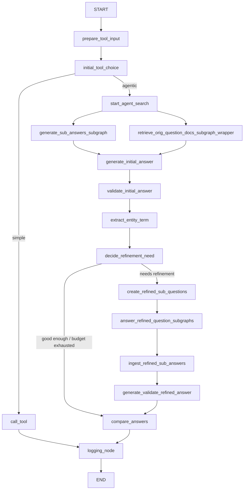

# LangGraph Agent Search with Exa Python SDK

LangGraph agent-search workflow using `exa-py`.

It does two things:

- Simple questions go through a single retrieval + synthesis pass.
- Comparison / multi-hop / ambiguous questions go through decomposition, validation, and at most one refinement loop by default.

Entry point: [`src/agent_search/graph.py`](/Users/deepankar.nath/Documents/Projects/playground/langgraph-sample-agent/src/agent_search/graph.py)

## Workflow Graph



`start_agent_search` fans out into two parallel retrieval branches:

- subquestion retrieval via `generate_sub_answers_subgraph`
- original-question retrieval via `retrieve_orig_question_docs_subgraph_wrapper`

Both branches append into `initial_results`, and `generate_initial_answer` runs after both upstream edges resolve.

## Node Order

1. `prepare_tool_input`
2. `initial_tool_choice`
3. `call_tool` or `start_agent_search`
4. `generate_sub_answers_subgraph`
5. `retrieve_orig_question_docs_subgraph_wrapper`
6. `generate_initial_answer`
7. `validate_initial_answer`
8. `extract_entity_term`
9. `decide_refinement_need`
10. `create_refined_sub_questions` if needed
11. `answer_refined_question_subgraphs`
12. `ingest_refined_sub_answers`
13. `generate_validate_refined_answer`
14. `compare_answers`
15. `logging_node`

## State Contract

Primary state type: [`src/agent_search/state.py`](/Users/deepankar.nath/Documents/Projects/playground/langgraph-sample-agent/src/agent_search/state.py)

Core routing fields:

- `question`
- `normalized_question`
- `query_type`
- `complexity`
- `route_intent`
- `time_sensitive`

Initial pass fields:

- `initial_subquestions`
- `initial_results`
- `orig_question_results`
- `initial_answer`

Validation / refinement fields:

- `entity_terms`
- `validation_report`
- `refinement_decision`
- `refined_subquestions`
- `refined_results`
- `refined_results_dedup`
- `refined_answer`
- `answer_comparison`

Final / ops fields:

- `final_answer`
- `tool_trace`
- `errors`
- `run_metadata`

Important detail: `coverage_gaps` is not a live graph state key anymore. The effective replacement is:

- `validation_report.unresolved_aspects`
- `refinement_decision.triggers`

## Search Modes and Routing

Schemas live in [`src/agent_search/schemas.py`](/Users/deepankar.nath/Documents/Projects/playground/langgraph-sample-agent/src/agent_search/schemas.py).

`search_request`:

```json
{
  "search_mode": "auto",
  "max_subquestions": 4,
  "max_refinement_rounds": 1,
  "include_trace": false
}
```

Supported `search_mode` values:

- `auto`
- `general`
- `code`
- `hybrid`

Routing behavior:

- Explicit `search_mode` overrides planner inference for `query_type`.
- Complexity is `simple` or `agentic`.
- Time sensitivity is inferred from the normalized question or planner output.
- `code` uses Exa code search profile.
- `hybrid` runs both web and code retrieval profiles.

Current caveat: `include_trace` is accepted by schema, but `final_answer.trace_summary` is currently not populated by the graph.

## Retrieval Layer

Retriever: [`src/agent_search/exa_client.py`](/Users/deepankar.nath/Documents/Projects/playground/langgraph-sample-agent/src/agent_search/exa_client.py)

Profiles:

- `general` -> `exa_search_web`
- `code` -> `exa_search_code`
- `hybrid` -> both profiles

Normalized evidence shape:

```json
{
  "source_id": "src_1",
  "url": "https://example.com",
  "title": "Example",
  "content": "trimmed content",
  "tool_name": "exa_search_web",
  "query": "What is LangGraph?",
  "subquestion_id": null
}
```

## Run

```bash
uv sync --extra dev
uv run langgraph dev --config langgraph.json
```

## Test

```bash
uv run pytest -q
```

Live Exa smoke tests:

```bash
RUN_LIVE_EXA_TESTS=1 uv run pytest -q tests/test_smoke_live.py
```

## Environment

Config lives in [`src/agent_search/config.py`](/Users/deepankar.nath/Documents/Projects/playground/langgraph-sample-agent/src/agent_search/config.py).

Important env vars:

- `EXA_API_KEY`
- `OPENAI_API_KEY` or `OPENROUTER_API_KEY`
- `OPENAI_MODEL`
- `OPENAI_BASE_URL`
- `AGENT_SEARCH_ENABLE_LLM`
- `AGENT_SEARCH_MAX_DOCS`
- `AGENT_SEARCH_CONTEXT_CHARS`
- `AGENT_SEARCH_CODE_TOKENS`
- `AGENT_SEARCH_CODE_DOMAINS`
- `AGENT_SEARCH_MAX_SUBQUESTIONS`
- `AGENT_SEARCH_MAX_REFINEMENTS`
- `LANGSMITH_API_KEY` and `LANGCHAIN_API_KEY` for tracing

Behavior:

- If no OpenAI/OpenRouter key is present, the graph still runs in extractive fallback mode.
- `AGENT_SEARCH_ENABLE_LLM` defaults to enabled when an OpenAI/OpenRouter key exists.
- Default model is `openrouter/hunter-alpha`.
- Default `OPENAI_BASE_URL` is `https://openrouter.ai/api/v1`.

## Example: Simple Route

Input:

```python
from langchain_core.messages import HumanMessage

{
  "messages": [HumanMessage(content="What is LangGraph?")]
}
```

Typical route result:

```json
{
  "query_type": "general",
  "complexity": "simple",
  "time_sensitive": false,
  "run_metadata": {
    "route": "simple",
    "query_type": "general",
    "refinement_rounds": 0
  }
}
```

Output shape:

```json
{
  "messages": [
    {
      "type": "ai",
      "content": "Answer (extractive): What is LangGraph?\n...\n\nSources:\n1. LangGraph Overview - https://..."
    }
  ],
  "final_answer": {
    "answer": "Answer (extractive): What is LangGraph?\n...",
    "confidence": 0.64,
    "used_refinement": false,
    "citations": [
      {
        "source_id": "src_1",
        "title": "LangGraph Overview",
        "url": "https://...",
        "tool_name": "exa_search_web"
      }
    ],
    "trace_summary": null
  },
  "validation_report": {
    "relevance_score": 0.52,
    "source_diversity_score": 0.5,
    "evidence_count": 1,
    "citation_count": 1,
    "time_sensitive": false,
    "unresolved_aspects": [
      "Evidence set is too thin for a reliable answer."
    ]
  },
  "refinement_decision": {
    "needs_refinement": false,
    "reason": "Simple route completed after one retrieval pass.",
    "triggers": [
      "Evidence set is too thin for a reliable answer."
    ],
    "remaining_rounds": 1,
    "max_rounds_reached": false
  }
}
```

## Example: Agentic Route

Input:

```python
{
  "question": "Compare LangGraph vs direct tool wrappers for Python agents",
  "search_request": {
    "search_mode": "auto",
    "max_subquestions": 4,
    "max_refinement_rounds": 1,
    "include_trace": false
  }
}
```

Representative intermediate state after the initial pass:

```json
{
  "complexity": "agentic",
  "query_type": "code",
  "time_sensitive": false,
  "initial_subquestions": [
    {
      "id": "subq_1",
      "text": "What source-backed strengths, limitations, and relevant facts matter about LangGraph for answering: Compare LangGraph vs direct tool wrappers for Python agents?",
      "rationale": "Cover the LangGraph branch directly.",
      "query_type": "code"
    },
    {
      "id": "subq_2",
      "text": "What source-backed strengths, limitations, and relevant facts matter about direct tool wrappers for Python agents for answering: Compare LangGraph vs direct tool wrappers for Python agents?",
      "rationale": "Cover the direct tool wrappers for Python agents branch directly.",
      "query_type": "code"
    }
  ],
  "orig_question_results": [
    {
      "source_id": "src_1",
      "subquestion_id": null
    }
  ],
  "initial_answer": {
    "coverage_score": 0.55,
    "source_support_score": 0.5
  },
  "validation_report": {
    "source_diversity_score": 0.33,
    "comparison_coverage": 0.5,
    "one_sided_comparison": true,
    "unresolved_aspects": [
      "Source diversity is low.",
      "Comparison evidence is one-sided or misses one side of the question."
    ]
  }
}
```

If refinement is triggered:

```json
{
  "entity_terms": ["LangGraph", "direct tool wrappers", "Python"],
  "refinement_decision": {
    "needs_refinement": true,
    "reason": "Refinement required because validation found unresolved gaps: Source diversity is low.; Comparison evidence is one-sided or misses one side of the question.",
    "triggers": [
      "Source diversity is low.",
      "Comparison evidence is one-sided or misses one side of the question."
    ],
    "remaining_rounds": 1,
    "max_rounds_reached": false
  },
  "refined_subquestions": [
    {
      "id": "refined_subq_1",
      "text": "For 'Compare LangGraph vs direct tool wrappers for Python agents', find evidence that directly compares LangGraph and direct tool wrappers and closes this gap: Comparison evidence is one-sided or misses one side of the question.",
      "rationale": "Address unresolved validation gap: Comparison evidence is one-sided or misses one side of the question.",
      "query_type": "code"
    }
  ]
}
```

Final output envelope:

```json
{
  "final_answer": {
    "answer": "...",
    "confidence": 0.79,
    "used_refinement": true,
    "citations": [
      {
        "source_id": "src_1",
        "url": "https://...",
        "title": "Official Documentation",
        "tool_name": "exa_search_code"
      }
    ],
    "trace_summary": null
  },
  "answer_comparison": {
    "chosen_answer": "refined",
    "reason": "Refined answer resolves more validation gaps."
  },
  "run_metadata": {
    "route": "agentic",
    "query_type": "code",
    "refinement_rounds": 1,
    "needs_refinement": false
  }
}
```

## Tests That Should Keep Passing

- [`tests/test_routing.py`](/Users/deepankar.nath/Documents/Projects/playground/langgraph-sample-agent/tests/test_routing.py)
- [`tests/test_refinement.py`](/Users/deepankar.nath/Documents/Projects/playground/langgraph-sample-agent/tests/test_refinement.py)
- [`tests/test_synthesis.py`](/Users/deepankar.nath/Documents/Projects/playground/langgraph-sample-agent/tests/test_synthesis.py)

## Notes

- Final chat output is assembled in [`src/agent_search/nodes/base.py`](/Users/deepankar.nath/Documents/Projects/playground/langgraph-sample-agent/src/agent_search/nodes/base.py) and lists up to 4 sources under `Sources:`.
- The simple route still computes `validation_report`, but it does not enter refinement.
- The agentic route chooses between `initial_answer` and `refined_answer` in `compare_answers`.
