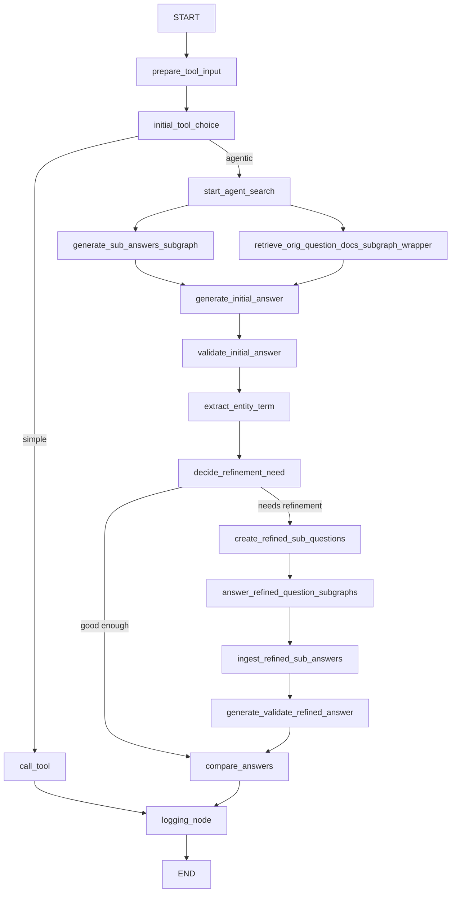
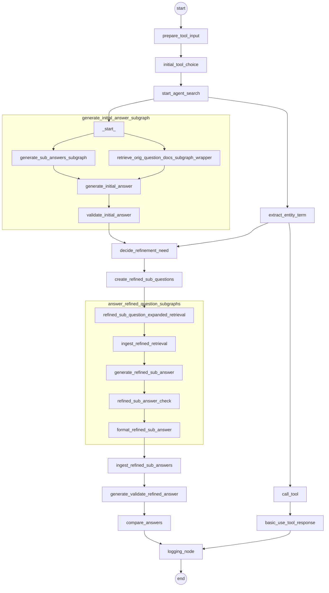

# LangGraph Agent Search with Exa Python SDK

Python implementation of an agent-search style LangGraph workflow using `exa-py`.

## Workflow Graph




## Original Workflow Graph




## Run

```bash
uv sync --extra dev
uv run langgraph dev --config langgraph.json
```

## Environment

- `EXA_API_KEY` for Exa SDK requests
- `OPENAI_API_KEY` or `OPENROUTER_API_KEY` optional (if missing, synthesis falls back to extractive mode)
- `OPENAI_BASE_URL` optional, defaults to `https://openrouter.ai/api/v1`
- `LANGSMITH_API_KEY` and `LANGCHAIN_API_KEY` optional but recommended for tracing

## Sample Input and Output by Subflow

### 1) Simple Fast Path

Input:

```json
{
  "question": "What is LangGraph?"
}
```

Route outcome:

```json
{
  "complexity": "simple",
  "query_type": "general"
}
```

Output shape (trimmed):

```json
{
  "final_answer": {
    "answer": "Question: What is LangGraph?...",
    "confidence": 0.64,
    "used_refinement": false,
    "citations": [
      {
        "source_id": "src_1",
        "title": "LangGraph Overview",
        "url": "https://...",
        "tool_name": "exa_search_web"
      }
    ],
    "trace_summary": null
  }
}
```

### 2) Agentic Initial Search Path

Input:

```json
{
  "question": "Compare LangGraph and direct tool wrappers for Python agents",
  "search_request": {
    "search_mode": "auto",
    "max_subquestions": 4,
    "max_refinement_rounds": 1,
    "include_trace": true
  }
}
```

Intermediate state example after initial pass (trimmed):

```json
{
  "complexity": "agentic",
  "time_sensitive": false,
  "initial_subquestions": [
    {
      "id": "subq_1",
      "text": "What source-backed strengths, limitations, and relevant facts matter about LangGraph for answering: Compare LangGraph and direct tool wrappers for Python agents?",
      "query_type": "code"
    }
  ],
  "initial_answer": {
    "coverage_score": 0.55,
    "source_support_score": 0.5
  },
  "validation_report": {
    "relevance_score": 0.61,
    "source_diversity_score": 0.33,
    "evidence_count": 3,
    "recency_score": 1.0,
    "unresolved_aspects": [
      "Source diversity is low.",
      "Comparison evidence is one-sided or misses one side of the question."
    ]
  },
  "coverage_gaps": [
    "Source diversity is low.",
    "Comparison evidence is one-sided or misses one side of the question."
  ]
}
```

### 3) Refinement Subflow

Refined question generation example:

```json
{
  "refined_subquestions": [
    {
      "id": "refined_subq_1",
      "text": "For 'Compare LangGraph and direct tool wrappers for Python agents', find evidence that directly compares LangGraph and direct tool wrappers and closes this gap: Comparison evidence is one-sided or misses one side of the question.",
      "rationale": "Close identified coverage gap",
      "query_type": "code"
    }
  ],
  "refinement_decision": {
    "needs_refinement": true,
    "reason": "Refinement required because validation found unresolved gaps: Source diversity is low.; Comparison evidence is one-sided or misses one side of the question.",
    "remaining_rounds": 1
  }
}
```

Refined retrieval + validation example (trimmed):

```json
{
  "refined_results_dedup": [
    {
      "source_id": "src_3",
      "title": "LangGraph docs",
      "tool_name": "exa_search_code"
    }
  ],
  "refined_answer": {
    "coverage_score": 0.78,
    "source_support_score": 0.8,
    "consistency_score": 0.75
  },
  "validation_report": {
    "relevance_score": 0.78,
    "source_diversity_score": 0.83,
    "evidence_count": 5,
    "recency_score": 1.0,
    "unresolved_aspects": []
  }
}
```

### 4) Final Output Envelope

Final response with trace (trimmed):

```json
{
  "final_answer": {
    "answer": "[refined] ...",
    "confidence": 0.79,
    "used_refinement": true,
    "citations": [
      {
        "source_id": "src_1",
        "url": "https://...",
        "title": "Official Documentation",
        "tool_name": "exa_search_code"
      },
      {
        "source_id": "src_2",
        "url": "https://...",
        "title": "Independent Analysis",
        "tool_name": "exa_search_web"
      }
    ],
    "trace_summary": {
      "route": "agentic",
      "query_type": "hybrid",
      "tool_calls": 6,
      "total_evidence": 9,
      "coverage_gaps": [],
      "needs_refinement": false,
      "refinement_rounds": 1,
      "error_count": 0,
      "duration_ms": 1843
    }
  },
  "answer_comparison": {
    "chosen_answer": "refined",
    "reason": "Refined answer resolves more validation gaps."
  }
}
```
